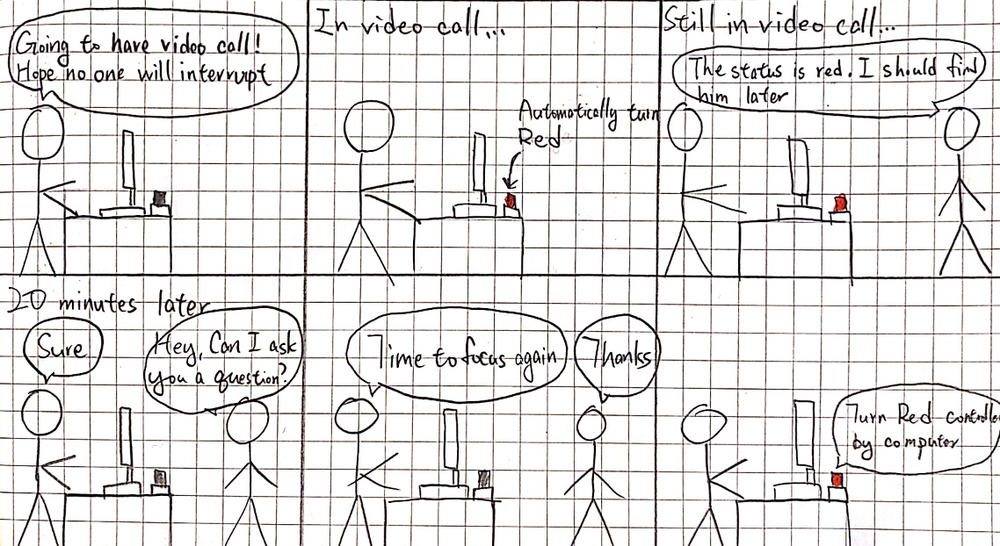
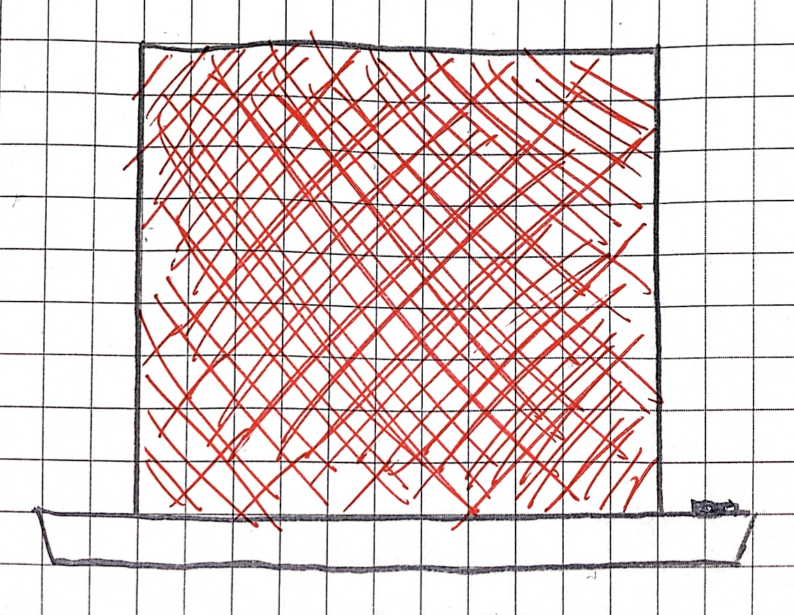
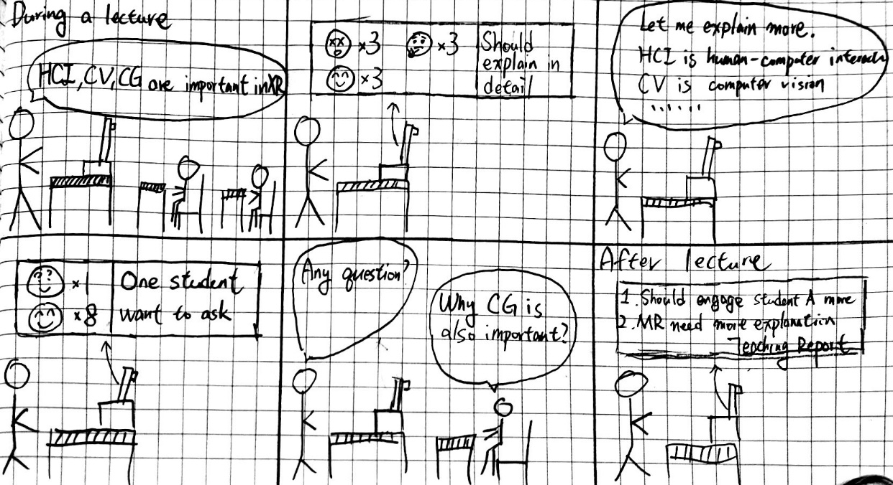

# Staging Interaction

In the original stage production of Peter Pan, Tinker Bell was represented by a darting light created by a small handheld mirror off-stage, reflecting a little circle of light from a powerful lamp. Tinkerbell communicates her presence through this light to the other characters. See more info [here](https://en.wikipedia.org/wiki/Tinker_Bell). 

There is no actor that plays Tinkerbell--her existence in the play comes from the interactions that the other characters have with her.

For lab this week, we draw on this and other inspirations from theatre to stage interactions with a device where the main mode of display/output for the interactive device you are designing is lighting. You will plot the interaction with a storyboard, and use your computer and a smartphone to experiment with what the interactions will look and feel like. _Make sure you read all the instructions and understand the whole of the laboratory activity before starting!_

## Prep

1. Set up [your Github "Lab Hub" repository](../../../) by [following these instructions](https://github.com/FAR-Lab/Developing-and-Designing-Interactive-Devices/blob/2021Spring/readings/Submitting%20Labs.md).
2. Set up the README.md for your Hub repository (for instance, so that it has your name and points to your own Lab 1) and [learn how](https://guides.github.com/features/mastering-markdown/) to post links to your submissions on your readme.md so we can find them easily.

### For lab, you will need:

1. Paper
1. Markers/ Pen
1. Smart Phone--Main required feature is that the phone needs to have a browser and display a webpage.
1. Computer--we will use your computer to host a webpage which also features controls
1. Found objects and materials--you’ll have to costume your phone so that it looks like some other device. These materials can include doll clothes, a paper lantern, a bottle, human clothes, a pillow case. Be creative!
1. Scissors

### Deliverables for this lab are: 
1. Storyboard
1. Sketches/photos of costumed device
1. Any reflections you have on the process.
1. Video sketch of the prototyped interaction.
1. Submit these in the lab1 folder of your class [Github page], either as links or uploaded files. Each group member should post their own copy of the work to their own Lab Hub, even if some of the work is the same for each person in the group.

## Overview
For this assignment, you are going to 

A) [Plan](#part-a-plan) 

B) [Act out the interaction](#part-b-act-out-the-interaction) 

C) [Prototype the device](#part-c-prototype-the-device)

D) [Wizard the device](#part-d-wizard-the-device) 

E) [Costume the device](#part-e-costume-the-device)

F) [Record the interaction](#part-f-record)

## The Report
This readme.md page in your own repository should be edited to include the work you have done. You can delete everything but the headers and the sections between the **stars**. Write the answers to the questions under the starred sentences. Include any material that explains what you did in this lab hub folder, and link it in the readme.

Labs are due on Mondays. Make sure this page is linked to on your main class hub page.

## Part A. Plan 

To stage the interaction with your interactive device, think about:

_Setting:_ Where is this interaction happening? (e.g., a jungle, the kitchen) When is it happening?

_Players:_ Who is involved in the interaction? Who else is there? If you reflect on the design of current day interactive devices like the Amazon Alexa, it’s clear they didn’t take into account people who had roommates, or the presence of children. Think through all the people who are in the setting.

_Activity:_ What is happening between the actors?

_Goals:_ What are the goals of each player? (e.g., jumping to a tree, opening the fridge). 

The interactive device can be anything *except* a computer, a tablet computer or a smart phone, but the main way it interacts needs to be using light.
**Describe your setting, players, activity and goals here.**

setting: The interaction is happening in an office on the table of the main actor's table.

players: The main actor using his/her computer and some other actors as his colleagues in the same office.

activity: The main actor is using his computer and the other actor is going to interrupt him and ask questions.

goals: The main actor's goal is he doesn't want to be interrupted when he is in a video call or he's in the flow state where he's very productive. And the other actor's goal is to know when is the best time to reach out to other people.

Sketch a storyboard of the interactions you are planning. It does not need to be perfect, but must get across the behavior of the interactive device and the other characters in the scene. 
**Include a picture of your storyboard here**

Present your idea to the other people in your breakout room. You can just get feedback from one another or you can work together on the other parts of the lab.
**Summarize feedback you got here.**

My original idea that I mentioned in the breakout room was a camera with lights that can automatically adjust the angle and brightness to help the user get better lighting for video calls. The feedback I got was I can use different colors to help make the video more natural and customized. However, I change the device I want to make after the breakout room.

## Part B. Act out the Interaction

Try physically acting out the interaction you planned. For now, you can just pretend the device is doing the things you’ve scripted for it. 

**Are there things that seemed better on paper than acted out?**

Yes. I found out that it is easy for other actors to see the interaction device on paper. But when acting out, the interaction device may be blocked by other things on the table. Therefore, I should also think about how this interaction device should be placed on the table.

**Are there new ideas that occur to you or your collaborators that come up from the acting?**

One new idea we came up with when acting is that the interactive device can use more color to indicate more status. For example, we can have a color orange to indicate that the actor is focusing and willing to be interrupted only by urgent requests. 

## Part C. Prototype the device

You will be using your smartphone as a stand-in for the device you are prototyping. You will use the browser of your smart phone to act as a “light” and use a remote control interface to remotely change the light on that device. 

Code for the "Tinkerbelle" tool, and instructions for setting up the server and your phone are [here](https://github.com/FAR-Lab/tinkerbelle).

We invented this tool for this lab! 
**Give us feedback on Tinkerbelle.**

It will be great if Tinkerbelle can have some buttons that can store some color codes that the user frequently uses. Therefore, when the user needs to use that color, he/she can just click on the button. 

## Part D. Wizard the device
Take a little time to set up the wizarding set-up that allows for someone to remotely control the device while someone acts with it. Hint: You can use Zoom to record videos, and you can pin someone’s video feed if that is the scene which you want to record. 

**Include your first attempts at recording the set-up video here.**

https://youtu.be/TCs9YHVlMQI

Now, hange the goal within the same setting, and update the interaction with the paper prototype. 

**Show the follow-up work here.**

https://youtu.be/2nzBOfJA2p8

## Part E. Costume the device

Only now should you start worrying about what the device should look like. Develop a costume so that you can use your phone as this device.

Think about the setting of the device: is the environment a place where the device could overheat? Is water a danger? Does it need to have bright colors in an emergency setting?

**Include sketches of what your device might look like here.**

**What concerns or opportunitities are influencing the way you've designed the device to look?**

To put it on the user's table, I think it will be better to make it as simple as possible to avoid distraction for the user.

## Part F. Record

**Take a video of your prototyped interaction.**

https://youtu.be/MbJENo7Zn5Q

**Please indicate anyone you collaborated with on this Lab.**

Thanks to Jeremy Shaffer, Ritika Poddar, Niki Agrawal, and Shivani Doshi for the feedback and inspiration in the breakout room session. Thanks to Ming-Chun (Jeff) Lu, Justin Liu for helping me with the video shooting.

# Staging Interaction, Part 2 

This describes the second week's work for this lab activity.

## Prep (to be done before Lab on Wednesday)

You will be assigned three partners from another group. Go to their github pages, view their videos, and provide them with reactions, suggestions & feedback: explain to them what you saw happening in their video. Guess the scene and the goals of the character. Ask them about anything that wasn’t clear. 

**Summarize feedback from your partners here.**

From Ritika:

1. In the video I can see the light turned red when the user opened zoom and then turned green when zoom was closed. 
2. It looks like the light turned red as soon as the zoom application was opened, before a call was even started. And then the light only turned green once the user closed the zoom screen completely. Does this mean even if a user isn’t on a zoom call but has the zoom window open the light will show red? That might be an issue if the user has the window open in the background and forgets to close it. 
3. I think you can probably place the light/device a little bit closer in the video to draw more attention to it. Initially I didn’t notice that the light was changing because it’s kind of small on the screen. 

From Niki:

1. It was clear through the text on the screen that the light indicated that you were either on the call (red) or off the call (green)
2. In recording your video, it didn’t seem like you were actually in the zoom call when the light was red, so I would just keep it on zoom the whole time.
3. Lastly, I would place the light device somewhere more clear like behind you with the light clearly facing the person walking in. By it being on the table, it seemed like the person had to lean a bit forward into the frame to see what color it was

Fro Jeremy:

The scene is someone walking in on another person on a video call who does not want to be interrupted. The device is “video call activated.” Here is what I saw happening:

1. Person A is about to join a video call. They have placed the device at the end of their table, which is in a neutral state (indicated with a yellow light).
2. When they join the video call, the device turns red, indicating that they should not be disturbed.
3. When Person B walks in, they see the red light and walk away so as not to disturb Person A.
4. When Person A ends their call, the device returns to a neutral state (yellow light).
5. Person B comes back and knows they can interact with Persona A now due to the yellow light

## Make it your own

Do last week’s assignment again, but this time: 
1) It doesn’t have to (just) use light, 
2) You can use any modality (e.g., vibration, sound) to prototype the behaviors, 
3) We will be grading with an emphasis on creativity. 

**Document everything here.**

**Describe your setting, players, activity and goals here.**

setting: The interaction is happening in a classroom and the device is placed on the table in front of the lecturer.

players: A teacher on the stage and some students in the classroom.

activity: The teacher is giving lecture on the stage and the students is listening to the lecture.

goals: The teacher's goal is to know how the students are learning. The teacher wants to use a camera that can analyze student's facial expression and display with emojis to indicate whether one student is confused, focus, distracted, bored, delightful. In this way, teacher can know what topics or concepts he/she should explain more to improve all the student's learning performance.

Sketch a storyboard of the interactions you are planning. It does not need to be perfect, but must get across the behavior of the interactive device and the other characters in the scene. 
**Include a picture of your storyboard here**

Present your idea to the other people in your breakout room. You can just get feedback from one another or you can work together on the other parts of the lab.
**Summarize feedback you got here.**

**Are there things that seemed better on paper than acted out?**

Yes. I found out that it is easy for other actors to see the interaction device on paper. But when acting out, the interaction device may be blocked by other things on the table. Therefore, I should also think about how this interaction device should be placed on the table.

**Are there new ideas that occur to you or your collaborators that come up from the acting?**

One new idea we came up with when acting is that the interactive device can use more color to indicate more status. For example, we can have a color orange to indicate that the actor is focusing and willing to be interrupted only by urgent requests. 

**Include your first attempts at recording the set-up video here.**

https://youtu.be/TCs9YHVlMQI

Now, hange the goal within the same setting, and update the interaction with the paper prototype. 

**Show the follow-up work here.**

https://youtu.be/2nzBOfJA2p8

**Include sketches of what your device might look like here.**

**What concerns or opportunitities are influencing the way you've designed the device to look?**

**Take a video of your prototyped interaction.**

https://youtu.be/MbJENo7Zn5Q

**Please indicate anyone you collaborated with on this Lab.**

Thanks to Jeremy Shaffer, Ritika Poddar, Niki Agrawal, and Shivani Doshi for the feedback and inspiration in the breakout room session. Thanks to Ming-Chun (Jeff) Lu, Justin Liu for helping me with the video shooting.

